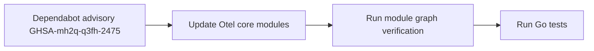

# GHSA-mh2q-q3fh-2475 Otel Dependency Update

## Acceptance

| Item | Expectation | Verification |
| --- | --- | --- |
| Vulnerable module | `go.opentelemetry.io/otel` is not in `>=1.36.0 <=1.40.0` | `go list -m all` shows `go.opentelemetry.io/otel v1.41.0` |
| Related Otel modules | Metric and trace APIs use the same fixed release line | `go.opentelemetry.io/otel/metric` and `go.opentelemetry.io/otel/trace` are `v1.41.0` |
| Module graph | Go module files are tidy | `go mod tidy -diff` has no output |

